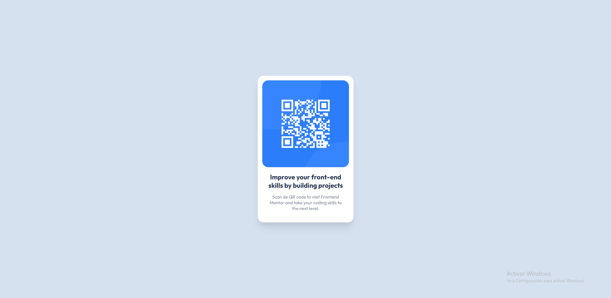

# Frontend Mentor - QR code component solution

This is a solution to the [QR code component challenge on Frontend Mentor](https://www.frontendmentor.io/challenges/qr-code-component-iux_sIO_H). Frontend Mentor challenges help you improve your coding skills by building realistic projects. 

## Table of contents

- [Overview](#overview)
  - [Screenshot](#screenshot)
  - [Links](#links)
- [My process](#my-process)
  - [Built with](#built-with)
  - [What I learned](#what-i-learned)
  - [Continued development](#continued-development)
- [Author](#author)

## Overview

### Screenshot

### Links

- Live Site URL: [(https://diegopaff.github.io/Frontend-Mentor_ch_01/)](https://diegopaff.github.io/Frontend-Mentor_ch_01/)

### Built with

- HTML5
- CSS
- Flexbox
- CSS Grid
- Mobile-first workflow

### What I learned

In this project I learn how to center a div in a responsive way and follow a design gideline to make the visuals just as the designer want it. 

### Continued development

In the future i will add this some interaction, like hover animations and maybe make a dark mode toggle button.

## Author

- Website - [Diego Curutchet](https://diegocurutchetdev.netlify.app/)
- Frontend Mentor - [@diegopaff](https://www.frontendmentor.io/profile/diegopaff)

